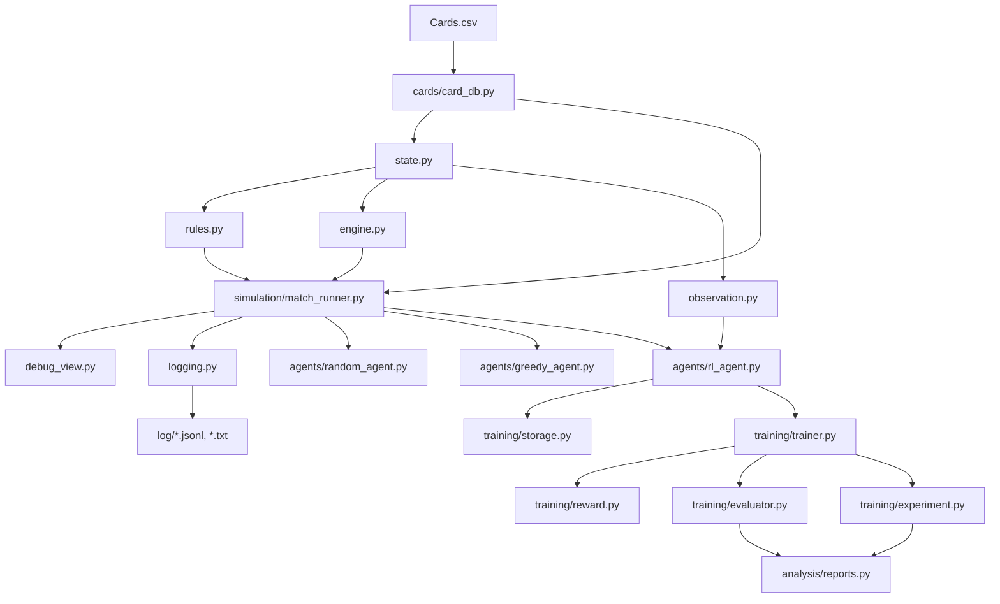

# Call of the King Python Prototype

이 디렉터리는 `Call of the King`의 Python 프로토타입 레이어입니다.

현재 목적:
- 게임 엔진 검증
- AI vs AI 자동 플레이 로그 생성
- 강화학습 기반 밸런싱 실험

장기적으로 실제 source of truth는 C# 서버가 담당하고, Python은 프로토타입, 테스트, 관측, 학습, 분석 레이어 역할을 맡습니다.

## 현재 기준

- 기본 실험 덱: `귤(World 2)` vs `샤를로테(World 6)`
- 카드 데이터 기본 파일: [Cards.csv](C:/code/capstone-temp/RL_AI/cards/Cards.csv)
- 로그 기본 저장 위치: [log](C:/code/capstone-temp/RL_AI/log)
- 보드 source of truth는 2D 배열이 아니라 `units registry`입니다.
- reward는 terminal reward만 사용합니다.
  - 승리 `+1`
  - 패배 `-1`
  - 무승부 `0`

## 핵심 파일

- [card_db.py](C:/code/capstone-temp/RL_AI/cards/card_db.py)
  - `Cards.csv`를 읽어 카드 정의 DB 생성
- [state.py](C:/code/capstone-temp/RL_AI/game_engine/state.py)
  - `GameState`, `UnitState`, `Action`, 초기 상태 생성
- [rules.py](C:/code/capstone-temp/RL_AI/game_engine/rules.py)
  - legal action 생성 / 판정
- [engine.py](C:/code/capstone-temp/RL_AI/game_engine/engine.py)
  - 상태 전이, 드로우, 카드 사용, 공격, 종료 판정
- [observation.py](C:/code/capstone-temp/RL_AI/game_engine/observation.py)
  - RL 입력용 observation 생성
- [match_runner.py](C:/code/capstone-temp/RL_AI/simulation/match_runner.py)
  - 수동 매치 / 랜덤 매치 / agent vs agent 실행
- [logging.py](C:/code/capstone-temp/RL_AI/simulation/logging.py)
  - JSONL / TXT 기보 로그 저장
- [rl_agent.py](C:/code/capstone-temp/RL_AI/agents/rl_agent.py)
  - PPO 기반 RL agent
- [trainer.py](C:/code/capstone-temp/RL_AI/training/trainer.py)
  - rollout 수집, PPO update
- [experiment.py](C:/code/capstone-temp/RL_AI/training/experiment.py)
  - 학습 전 평가 -> 학습 -> 학습 후 평가 실험

## match_runner 호출 구조

이 프로젝트에서 제일 헷갈리기 쉬운 흐름은 `match_runner.py`입니다.

### 1. 수동 대전

실행:
```powershell
python -m RL_AI.simulation.match_runner
```

실제 호출 흐름:

```text
__main__
  -> run_manual_match()
    -> load_supported_card_db()
      -> cards/card_db.py
    -> create_initial_game_state()
      -> state.py
    -> MatchRunner.initialize()
      -> initialize_main_phase()
      -> engine.py
    -> 반복 루프
      -> get_legal_actions()
      -> rules.py
      -> debug_view.print_state()
      -> 사용자 입력
      -> apply_action()
      -> engine.py
      -> logging.MatchLogger (옵션)
    -> match_end 로그 저장
```

### 2. 랜덤 대전

실행:
```powershell
python -c "from RL_AI.simulation.match_runner import run_random_match; run_random_match(seed=7)"
```

실제 호출 흐름:

```text
run_random_match()
  -> load_supported_card_db()
  -> create_initial_game_state()
  -> initialize_main_phase()
  -> while not terminal:
       -> get_legal_actions()
       -> choose_action_randomly()
       -> apply_action()
       -> logging.py에 action/state 저장
  -> 종료 상태 반환
```

### 3. 에이전트 vs 에이전트 대전

실행:
```powershell
python -c "from RL_AI.agents.greedy_agent import GreedyAgent; from RL_AI.agents.random_agent import RandomAgent; from RL_AI.simulation.match_runner import run_agent_match; run_agent_match(GreedyAgent(seed=1), RandomAgent(seed=2), seed=7)"
```

실제 호출 흐름:

```text
run_agent_match(p1_agent, p2_agent)
  -> load_supported_card_db()
  -> create_initial_game_state()
  -> initialize_main_phase()
  -> while not terminal:
       -> get_legal_actions()
       -> 현재 플레이어 agent.select_action()
          -> random_agent / greedy_agent / rl_agent
       -> apply_action()
       -> logging.py 기록
  -> 종료 상태 반환
```

## RL 호출 구조

### 4. RL 학습

실행 예시:
```powershell
python -c "from RL_AI.agents.rl_agent import RLAgent; from RL_AI.agents.random_agent import RandomAgent; from RL_AI.training.trainer import PPOTrainer; agent=RLAgent(seed=1); trainer=PPOTrainer(agent); print(trainer.train(num_episodes=20, opponent_agent=RandomAgent(seed=3), seed=11, max_steps=200))"
```

실제 호출 흐름:

```text
PPOTrainer.train()
  -> collect_episode()
     -> create_initial_game_state()
     -> initialize_main_phase()
     -> while not terminal:
          -> get_legal_actions()
          -> RLAgent.compute_policy_output()
             -> observation.py
             -> rl_agent.py
          -> apply_action()
     -> reward.py로 terminal reward 부여
     -> storage.py에 rollout 정리
  -> update_from_buffer()
     -> PPO loss 계산
     -> torch optimizer step
```

### 5. 학습 전/후 평가 실험

실행 예시:
```powershell
python -c "from RL_AI.training.experiment import run_train_eval_experiment; result=run_train_eval_experiment(eval_matches_before=30, train_episodes=50, eval_matches_after=30, seed=7, max_steps=200); print(result['report_path'])"
```

실제 호출 흐름:

```text
run_train_eval_experiment()
  -> trainer.evaluate()   # 학습 전
     -> evaluator.py
     -> run multiple matches
  -> trainer.train()      # 학습
  -> trainer.evaluate()   # 학습 후
  -> analysis/reports.py
  -> log/train_eval_report_*.txt 저장
```

## 한눈에 보는 전체 구조



## 기본 실행 명령

프로젝트 루트 `C:\code\capstone-temp` 에서 실행합니다.

수동 대전:
```powershell
python -m RL_AI.simulation.match_runner
```

랜덤 대전:
```powershell
python -c "from RL_AI.simulation.match_runner import run_random_match; run_random_match(seed=7)"
```

Greedy vs Random:
```powershell
python -c "from RL_AI.agents.greedy_agent import GreedyAgent; from RL_AI.agents.random_agent import RandomAgent; from RL_AI.simulation.match_runner import run_agent_match; run_agent_match(GreedyAgent(seed=1), RandomAgent(seed=2), seed=7, max_steps=100, print_steps=True)"
```

RL 학습:
```powershell
python -c "from RL_AI.agents.rl_agent import RLAgent; from RL_AI.agents.random_agent import RandomAgent; from RL_AI.training.trainer import PPOTrainer; agent=RLAgent(seed=1); trainer=PPOTrainer(agent); print(trainer.train(num_episodes=20, opponent_agent=RandomAgent(seed=3), seed=11, max_steps=200))"
```

학습 전/후 평가:
```powershell
python -c "from RL_AI.training.experiment import run_train_eval_experiment; result=run_train_eval_experiment(eval_matches_before=30, train_episodes=50, eval_matches_after=30, seed=7, max_steps=200); print(result['report_path'])"
```

## 로그와 리포트

저장 위치: [log](C:/code/capstone-temp/RL_AI/log)

생성 파일:
- `*.jsonl`: 분석용 구조화 로그
- `*.txt`: 사람이 읽는 기보 로그
- `train_eval_report_*.txt`: 학습 전/후 평가 리포트

에이전트 매치 로그에는 `P1 agent=...`, `P2 agent=...`가 같이 기록됩니다.

## 테스트

테스트 위치: [tests](C:/code/capstone-temp/RL_AI/tests)

코어 테스트:
```powershell
python -m pytest RL_AI\tests\test_engine_core.py -q
```

legal action 검증:
```powershell
python -m pytest RL_AI\tests\test_legal_actions_validation.py -q
```

greedy 테스트:
```powershell
python -m pytest RL_AI\tests\test_greedy_agent.py -q
```

전체 주요 테스트:
```powershell
python -m pytest RL_AI\tests\test_engine_core.py RL_AI\tests\test_greedy_agent.py RL_AI\tests\test_legal_actions_validation.py -q
```

## 강화학습 짧은 메모

- `rollout`
  - 에이전트가 실제 게임을 하면서 쌓은 플레이 기록입니다.
  - 강화학습에서는 이 기록이 학습 데이터 역할을 합니다.

- `PPO`
  - `Proximal Policy Optimization`의 줄임말입니다.
  - 정책을 한 번에 너무 크게 바꾸지 않고 조금씩 안정적으로 업데이트하는 강화학습 알고리즘입니다.

## 그림 그릴 때 쓸 만한 도구

README 같은 문서 안에서 바로 그리고 싶으면:
- `Mermaid`
- `Markdown + Mermaid Preview`

브라우저에서 빠르게 구조도 그리려면:
- `draw.io` / `diagrams.net`
- `Mermaid Live Editor`
- `Excalidraw`

추천 기준:
- 코드/문서에 같이 넣고 싶다: `Mermaid`
- 박스/화살표를 손으로 편하게 옮기고 싶다: `draw.io`
- 빠르게 회의용 스케치가 필요하다: `Excalidraw`

## 참고

- `rules.py`는 상태를 바꾸지 않습니다.
- `engine.py`는 상태 전이만 담당합니다.
- `debug_view.py`는 사람용, `logging.py`는 분석용입니다.
- 같은 종류 카드 여러 장은 `card_id`가 아니라 `card_instance_id` 기준으로 구분합니다.
