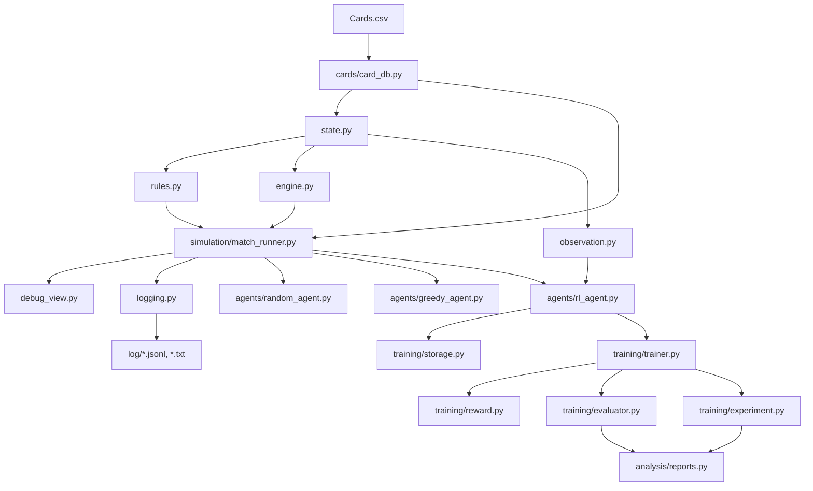

# Call of the King Python Prototype

이 디렉터리는 `Call of the King`의 Python 프로토타입 레이어입니다.

현재 목적:
- 게임 엔진 검증
- AI vs AI 자동 플레이 로그 생성
- 강화학습 기반 밸런싱 실험

장기적으로 실제 source of truth는 C# 서버가 담당하고, Python은 프로토타입, 테스트, 관측, 학습, 분석 레이어 역할을 맡습니다.

## 현재 기준

- 기본 실험 덱: `귤(World 2)` vs `샤를로테(World 6)`
- 카드 데이터 기본 파일: [Cards.csv](C:/code/capstone-temp/RL_AI/cards/Cards.csv)
- 로그 기본 저장 위치: [log](C:/code/capstone-temp/RL_AI/log)
- 상태 source of truth는 2D 보드 배열이 아니라 `units registry`입니다.
- reward는 terminal reward만 사용합니다.
  - 승리 `+1`
  - 패배 `-1`
  - 무승부 `0`
- RL 프레임워크는 `TensorFlow`가 아니라 `PyTorch`입니다.
- 현재 RL 알고리즘은 `PPO` 기반입니다.

## 지금까지 반영된 큰 변경

- 카드 DB 기본 입력을 `Cards.tsv`에서 `Cards.csv`로 변경
- `CardID`를 `0x...` 형식에서 `Or_L`, `Cl_B` 같은 prefix 기반 형식으로 변경
- 런타임 카드/유닛 ID를 순차형으로 변경
  - 예: `C000`, `U000`
- 기본 실험 덱을 `체스 vs 귤`에서 `귤 vs 샤를로테`로 변경
- 평가 루프에 `max_turns`를 추가해서 `100턴 제한` 같은 실험 가능
- `evaluate_agents(...)` 결과를 자동으로 [log](C:/code/capstone-temp/RL_AI/log) 아래 `evaluation_report_*.txt`로 저장하도록 변경

## 핵심 파일

- [card_db.py](C:/code/capstone-temp/RL_AI/cards/card_db.py)
  - `Cards.csv`를 읽어 카드 정의 DB 생성
- [state.py](C:/code/capstone-temp/RL_AI/game_engine/state.py)
  - `GameState`, `UnitState`, `Action`, 초기 상태 생성
- [rules.py](C:/code/capstone-temp/RL_AI/game_engine/rules.py)
  - legal action 생성 / 판정
- [engine.py](C:/code/capstone-temp/RL_AI/game_engine/engine.py)
  - 상태 전이, 드로우, 카드 사용, 공격, 종료 판정
- [observation.py](C:/code/capstone-temp/RL_AI/game_engine/observation.py)
  - RL 입력용 observation 생성
- [match_runner.py](C:/code/capstone-temp/RL_AI/simulation/match_runner.py)
  - 수동 매치 / 랜덤 매치 / agent vs agent 실행
- [logging.py](C:/code/capstone-temp/RL_AI/simulation/logging.py)
  - JSONL / TXT 기보 로그 저장
- [rl_agent.py](C:/code/capstone-temp/RL_AI/agents/rl_agent.py)
  - PyTorch + PPO 기반 RL agent
- [trainer.py](C:/code/capstone-temp/RL_AI/training/trainer.py)
  - rollout 수집, PPO update
- [evaluator.py](C:/code/capstone-temp/RL_AI/training/evaluator.py)
  - 다회전 평가 + 평가 리포트 자동 저장
- [experiment.py](C:/code/capstone-temp/RL_AI/training/experiment.py)
  - 학습 전 평가 -> 학습 -> 학습 후 평가 실험

## match_runner 호출 구조

### 1. 수동 대전

실행:
```powershell
python -m RL_AI.simulation.match_runner
```

실제 호출 흐름:

```text
__main__
  -> run_manual_match()
    -> state.load_supported_card_db()
      -> cards/card_db.py
    -> state.create_initial_game_state()
    -> engine.initialize_main_phase()
    -> 반복 루프
      -> rules.get_legal_actions()
      -> debug_view.print_state()
      -> 사용자 입력
      -> engine.apply_action()
      -> logging.MatchLogger (옵션)
    -> match_end 로그 저장
```

### 2. 랜덤 대전

실행:
```powershell
python -c "from RL_AI.simulation.match_runner import run_random_match; run_random_match(seed=7)"
```

실제 호출 흐름:

```text
run_random_match()
  -> state.load_supported_card_db()
  -> state.create_initial_game_state()
  -> engine.initialize_main_phase()
  -> while not terminal:
       -> rules.get_legal_actions()
       -> choose_action_randomly()
       -> engine.apply_action()
       -> logging.py에 action/state 저장
  -> 종료 상태 반환
```

### 3. 에이전트 vs 에이전트 대전

실행:
```powershell
python -c "from RL_AI.agents.greedy_agent import GreedyAgent; from RL_AI.agents.random_agent import RandomAgent; from RL_AI.simulation.match_runner import run_agent_match; run_agent_match(GreedyAgent(seed=1), RandomAgent(seed=2), seed=7)"
```

실제 호출 흐름:

```text
run_agent_match(p1_agent, p2_agent)
  -> state.load_supported_card_db()
  -> state.create_initial_game_state()
  -> engine.initialize_main_phase()
  -> while not terminal:
       -> rules.get_legal_actions()
       -> 현재 플레이어 agent.select_action()
          -> random_agent / greedy_agent / rl_agent
       -> engine.apply_action()
       -> logging.py 기록
  -> 종료 상태 반환
```

## RL 호출 구조

### 4. RL 학습

실행 예시:
```powershell
python -c "from RL_AI.agents.rl_agent import RLAgent; from RL_AI.agents.random_agent import RandomAgent; from RL_AI.training.trainer import PPOTrainer; agent=RLAgent(seed=1); trainer=PPOTrainer(agent); print(trainer.train(num_episodes=20, opponent_agent=RandomAgent(seed=3), seed=11, max_steps=999999, max_turns=100))"
```

실제 호출 흐름:

```text
PPOTrainer.train()
  -> collect_episode()
     -> state.create_initial_game_state()
     -> engine.initialize_main_phase()
     -> while not terminal:
          -> rules.get_legal_actions()
          -> RLAgent.compute_policy_output()
             -> observation.py
             -> rl_agent.py
          -> engine.apply_action()
     -> reward.py로 terminal reward 부여
     -> storage.py에 rollout 정리
  -> update_from_buffer()
     -> PPO loss 계산
     -> torch optimizer step
```

### 5. 학습 전/후 평가 실험

실행 예시:
```powershell
python -c "import time; from RL_AI.agents.rl_agent import RLAgent; from RL_AI.agents.random_agent import RandomAgent; from RL_AI.agents.greedy_agent import GreedyAgent; from RL_AI.training.trainer import PPOTrainer; from RL_AI.training.evaluator import evaluate_agents; agent=RLAgent(seed=1); trainer=PPOTrainer(agent); t0=time.time(); before=evaluate_agents(agent, GreedyAgent(seed=2), num_matches=50, seed=7, max_steps=999999, max_turns=100); t1=time.time(); train=trainer.train(num_episodes=100, opponent_agent=RandomAgent(seed=3), seed=11, max_steps=999999, max_turns=100); t2=time.time(); after=evaluate_agents(agent, GreedyAgent(seed=2), num_matches=50, seed=21, max_steps=999999, max_turns=100); t3=time.time(); print(before['report_path']); print(after['report_path']); print(t1-t0, t2-t1, t3-t2, t3-t0)"
```

실제 호출 흐름:

```text
학습 전 평가
  -> evaluator.evaluate_agents()
  -> log/evaluation_report_*.txt 저장
학습
  -> trainer.train()
학습 후 평가
  -> evaluator.evaluate_agents()
  -> log/evaluation_report_*.txt 저장
```

## 한눈에 보는 전체 구조



## 기본 실행 명령

프로젝트 루트 `C:\code\capstone-temp` 에서 실행합니다.

수동 대전:
```powershell
python -m RL_AI.simulation.match_runner
```

랜덤 대전:
```powershell
python -c "from RL_AI.simulation.match_runner import run_random_match; run_random_match(seed=7, max_steps=999999, max_turns=100)"
```

Greedy vs Random:
```powershell
python -c "from RL_AI.agents.greedy_agent import GreedyAgent; from RL_AI.agents.random_agent import RandomAgent; from RL_AI.simulation.match_runner import run_agent_match; run_agent_match(GreedyAgent(seed=1), RandomAgent(seed=2), seed=7, max_steps=999999, max_turns=100, print_steps=True)"
```

RL vs RL 평가:
```powershell
python -c "from RL_AI.agents.rl_agent import RLAgent; from RL_AI.training.evaluator import evaluate_agents; summary=evaluate_agents(RLAgent(seed=1), RLAgent(seed=2), num_matches=1000, seed=7, max_steps=999999, max_turns=100); print(summary['report_path'])"
```

RL vs Greedy 평가:
```powershell
python -c "from RL_AI.agents.rl_agent import RLAgent; from RL_AI.agents.greedy_agent import GreedyAgent; from RL_AI.training.evaluator import evaluate_agents; summary=evaluate_agents(RLAgent(seed=1), GreedyAgent(seed=2), num_matches=100, seed=7, max_steps=999999, max_turns=100); print(summary['report_path'])"
```

RL 학습:
```powershell
python -c "from RL_AI.agents.rl_agent import RLAgent; from RL_AI.agents.random_agent import RandomAgent; from RL_AI.training.trainer import PPOTrainer; agent=RLAgent(seed=1); trainer=PPOTrainer(agent); print(trainer.train(num_episodes=100, opponent_agent=RandomAgent(seed=3), seed=11, max_steps=999999, max_turns=100))"
```

## 평가 / 학습 실험 명령 모음

평가만 해보기:
- 현재 정책으로 여러 판을 붙여서 승률, 행동 통계, 카드 사용 통계를 확인합니다.
- 결과는 터미널에 출력되고, 동시에 `RL_AI/log/evaluation_report_*.txt`로 저장됩니다.

RL vs RL 평가:
```powershell
python -c "from RL_AI.agents.rl_agent import RLAgent; from RL_AI.training.evaluator import evaluate_agents; summary=evaluate_agents(RLAgent(seed=1), RLAgent(seed=2), num_matches=100, seed=7, max_steps=999999, max_turns=100); print(summary['report_path'])"
```

RL vs Greedy 평가:
```powershell
python -c "from RL_AI.agents.rl_agent import RLAgent; from RL_AI.agents.greedy_agent import GreedyAgent; from RL_AI.training.evaluator import evaluate_agents; summary=evaluate_agents(RLAgent(seed=1), GreedyAgent(seed=2), num_matches=100, seed=7, max_steps=999999, max_turns=100); print(summary['report_path'])"
```

학습만 해보기:
- RLAgent를 상대 에이전트와 반복 대전시키면서 PPO로 가중치를 업데이트합니다.
- 처음에는 `RandomAgent`를 상대로 학습시키는 편이 안정적입니다.

```powershell
python -c "from RL_AI.agents.rl_agent import RLAgent; from RL_AI.agents.random_agent import RandomAgent; from RL_AI.training.trainer import PPOTrainer; agent=RLAgent(seed=1); trainer=PPOTrainer(agent); print(trainer.train(num_episodes=100, opponent_agent=RandomAgent(seed=3), seed=11, max_steps=999999, max_turns=100))"
```

학습 전 평가 -> 학습 -> 학습 후 평가를 한 번에:
- 같은 `RLAgent` 인스턴스를 유지한 채로 전후 비교를 합니다.
- 이 방식이 가장 정확한 1차 실험 방법입니다.

```powershell
python -c "import time; from RL_AI.agents.rl_agent import RLAgent; from RL_AI.agents.random_agent import RandomAgent; from RL_AI.agents.greedy_agent import GreedyAgent; from RL_AI.training.trainer import PPOTrainer; from RL_AI.training.evaluator import evaluate_agents; agent=RLAgent(seed=1); trainer=PPOTrainer(agent); t0=time.time(); before=evaluate_agents(agent, GreedyAgent(seed=2), num_matches=50, seed=7, max_steps=999999, max_turns=100); t1=time.time(); train=trainer.train(num_episodes=100, opponent_agent=RandomAgent(seed=3), seed=11, max_steps=999999, max_turns=100); t2=time.time(); after=evaluate_agents(agent, GreedyAgent(seed=2), num_matches=50, seed=21, max_steps=999999, max_turns=100); t3=time.time(); print(f'BEFORE report: {before[\"report_path\"]}'); print(f'BEFORE time: {t1-t0:.2f}s'); print(train); print(f'TRAIN time: {t2-t1:.2f}s'); print(f'AFTER report: {after[\"report_path\"]}'); print(f'AFTER time: {t3-t2:.2f}s'); print(f'TOTAL time: {t3-t0:.2f}s')"
```

## 로그와 리포트

저장 위치: [log](C:/code/capstone-temp/RL_AI/log)

생성 파일:
- `*.jsonl`: 분석용 구조화 로그
- `*.txt`: 사람이 읽는 기보 로그
- `evaluation_report_*.txt`: 평가 리포트
- `train_eval_report_*.txt`: 학습 전/후 평가 리포트

에이전트 매치 로그에는 `P1 agent=...`, `P2 agent=...`가 같이 기록됩니다.

평가 리포트에는 다음이 포함됩니다.
- 승 / 패 / 무
- 평균 step 수
- 평균 final turn
- 행동 타입 통계
- 카드 사용 통계

## 현재 학습 상태 메모

현재 기준으로는 PPO 학습이 실제로 동작합니다.

확인된 점:
- `RLAgent vs GreedyAgent` 비교에서 학습 전보다 학습 후 RL 승률이 올라감
- 즉, 현재 학습 루프가 완전히 무의미한 상태는 아님
- 다만 아직 `GreedyAgent`보다 강하다고 보기는 어려움

현재 해석:
- RL은 아직 baseline 추격 단계
- observation, action encoding, self-play, 평가 루프 고도화 여지가 큼
- 지금은 “정말 학습이 되는가”를 확인한 첫 단계라고 보면 됨

최근 예시:
- 학습 전 `RL vs Greedy` 평가에서 RL 승률이 낮았음
- 짧은 PPO 학습 후 같은 조건에서 RL 승률이 눈에 띄게 상승했음
- 즉, 현재 구조는 “학습 전 평가 -> 학습 -> 학습 후 평가” 사이클을 실제로 돌릴 수 있는 상태임

## DLPC 실행 메모

- DLPC 같은 리눅스 서버로 옮길 때는 `RL_AI` 폴더를 통째로 복사하거나 압축 해제해서 사용하면 됩니다.
- 실행 위치는 보통 `RL_AI`의 부모 디렉터리입니다.
- RL 실행에는 `torch`가 필요합니다.

예시:
```bash
python -m venv ~/rlai-venv
source ~/rlai-venv/bin/activate
python -m pip install --upgrade pip
python -m pip install torch pytest
python -m RL_AI.simulation.match_runner
```

## 테스트

테스트 위치: [tests](C:/code/capstone-temp/RL_AI/tests)

코어 테스트:
```powershell
python -m pytest RL_AI\tests\test_engine_core.py -q
```

legal action 검증:
```powershell
python -m pytest RL_AI\tests\test_legal_actions_validation.py -q
```

greedy 테스트:
```powershell
python -m pytest RL_AI\tests\test_greedy_agent.py -q
```

전체 주요 테스트:
```powershell
python -m pytest RL_AI\tests\test_engine_core.py RL_AI\tests\test_greedy_agent.py RL_AI\tests\test_legal_actions_validation.py -q
```

## 강화학습 짧은 메모

- `episode`
  - 게임 한 판 전체입니다.
  - 현재 프로젝트에서는 거의 `episode = match`로 이해하면 됩니다.

- `step`
  - 행동 1번입니다.
  - 이동 1번, 공격 1번, 카드 사용 1번, 턴 종료 1번이 각각 1 step입니다.

- `turn`
  - 한 플레이어의 턴입니다.
  - `max_turns=100`처럼 실제 턴 제한 실험을 할 수 있습니다.

- `rollout`
  - 에이전트가 실제 게임을 하면서 쌓은 플레이 기록입니다.
  - 강화학습에서는 이 기록이 학습 데이터 역할을 합니다.

- `PPO`
  - `Proximal Policy Optimization`의 줄임말입니다.
  - 정책을 한 번에 너무 크게 바꾸지 않고 조금씩 안정적으로 업데이트하는 강화학습 알고리즘입니다.

## 그림 그릴 때 쓸 만한 도구

README 같은 문서 안에서 바로 그리고 싶으면:
- `Mermaid`
- `Markdown + Mermaid Preview`

브라우저에서 빠르게 구조도 그리려면:
- `draw.io` / `diagrams.net`
- `Mermaid Live Editor`
- `Excalidraw`

추천 기준:
- 코드/문서에 같이 넣고 싶다: `Mermaid`
- 박스/화살표를 손으로 편하게 옮기고 싶다: `draw.io`
- 빠르게 회의용 스케치가 필요하다: `Excalidraw`

## 참고

- `rules.py`는 상태를 바꾸지 않습니다.
- `engine.py`는 상태 전이만 담당합니다.
- `debug_view.py`는 사람용, `logging.py`는 분석용입니다.
- 같은 종류 카드 여러 장은 `card_id`가 아니라 `card_instance_id` 기준으로 구분합니다.
