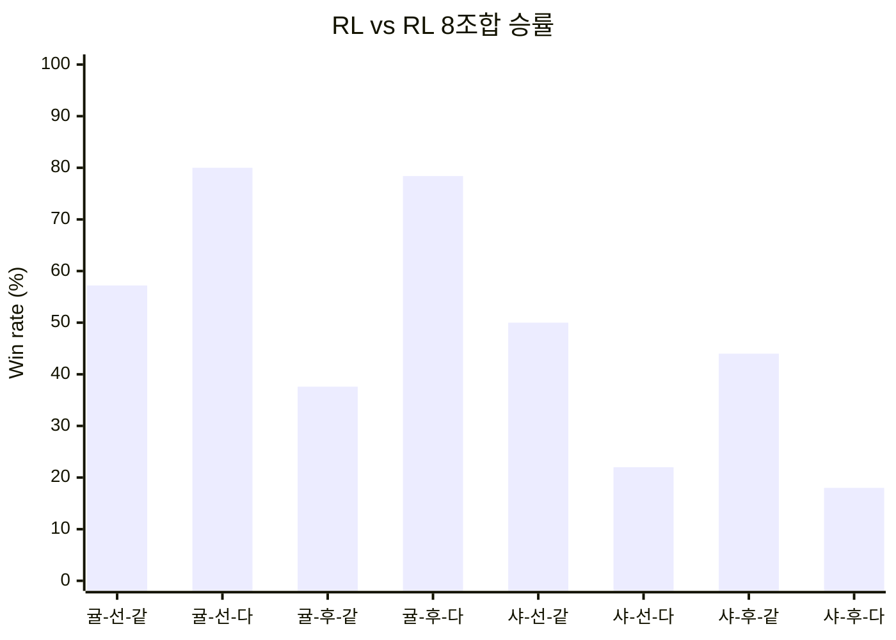

# Call of the King: RL_AI

## 한 줄 요약
Python RL 학습 루프와 C# SeaEngine을 연결해, 귤/샤를로테 양쪽에서 안정적으로 작동하는 범용 전술 AI를 만드는 프로젝트.

## 목표
- 일반 사용자 수준을 넘어서는 실전형 AI
- 선공/후공, 귤/샤를로테, 같은 덱/다른 덱에서 골고루 강한 정책
- 하루 1 cycle 안에 학습, 밸런싱, 편향 진단까지 끝내는 실행 구조

## 시스템 구성
| 구성요소 | 역할 |
|---|---|
| `start.py` | 학습 전후 평가, PPO 학습, checkpoint 평가 |
| `make_balance.py` | RL vs RL 8조합 밸런싱 측정 |
| `bias_check.py` | random/greedy/rule-based/RL 편향 진단 |
| `SeaEngine` | C# 게임 엔진 |
| `pythonnet_session.py` | Python-Net 브리지 |

## 현재 접근
- PPO + GAE 기반 학습
- balanced layout으로 8조합을 고르게 학습
- random / greedy / rule-based / self-play opponent pool 사용
- opening diversity, imitation learning, hard example mining, population-based checkpoint selection 반영
- belief-MCTS는 restore 기반으로 얕게 사용

## 최신 관찰 결과
| 항목 | 요약 |
|---|---|
| 학습 후 vs Random | 약 91.5% |
| 학습 후 vs Greedy | 약 70.5% |
| 학습 후 vs Rule-based | 약 56.0% |
| 학습 후 vs Self | 약 52.2% |
| RL vs RL 전체 | 약 48.4% |
| 주요 편향 | 귤/샤를로테, 선공/후공, same/different deck 편차 |
| 최신 1 cycle | 약 8시간 37분 |

## 그래프

### 밸런싱 8조합



```text
귤-선-같 57.2 | 귤-선-다 80.0 | 귤-후-같 37.6 | 귤-후-다 78.4
샤-선-같 50.0 | 샤-선-다 22.0 | 샤-후-같 44.0 | 샤-후-다 18.0
```

### 학습 전

<table>
<tr>
<td width="25%" align="center" valign="top">
<div class="mermaid">
%%{init: {'themeVariables': {'pie1': '#2563eb', 'pie2': '#dc2626', 'pie3': '#7c3aed'}}}%%
pie title Random
    "Win" : 304
    "Lose" : 53
    "Draw" : 43
</div>
</td>
<td width="25%" align="center" valign="top">
<div class="mermaid">
%%{init: {'themeVariables': {'pie1': '#2563eb', 'pie2': '#dc2626', 'pie3': '#7c3aed'}}}%%
pie title Greedy
    "Win" : 151
    "Lose" : 232
    "Draw" : 17
</div>
</td>
<td width="25%" align="center" valign="top">
<div class="mermaid">
%%{init: {'themeVariables': {'pie1': '#2563eb', 'pie2': '#dc2626', 'pie3': '#7c3aed'}}}%%
pie title Rule-based
    "Win" : 189
    "Lose" : 211
    "Draw" : 0
</div>
</td>
<td width="25%" align="center" valign="top">
<div class="mermaid">
%%{init: {'themeVariables': {'pie1': '#2563eb', 'pie2': '#dc2626', 'pie3': '#7c3aed'}}}%%
pie title Self
    "Win" : 236
    "Lose" : 164
    "Draw" : 0
</div>
</td>
</tr>
</table>

### 학습 후

<table>
<tr>
<td width="25%" align="center" valign="top">
<div class="mermaid">
%%{init: {'themeVariables': {'pie1': '#2563eb', 'pie2': '#dc2626', 'pie3': '#7c3aed'}}}%%
pie title Random
    "Win" : 366
    "Lose" : 32
    "Draw" : 2
</div>
</td>
<td width="25%" align="center" valign="top">
<div class="mermaid">
%%{init: {'themeVariables': {'pie1': '#2563eb', 'pie2': '#dc2626', 'pie3': '#7c3aed'}}}%%
pie title Greedy
    "Win" : 282
    "Lose" : 118
    "Draw" : 0
</div>
</td>
<td width="25%" align="center" valign="top">
<div class="mermaid">
%%{init: {'themeVariables': {'pie1': '#2563eb', 'pie2': '#dc2626', 'pie3': '#7c3aed'}}}%%
pie title Rule-based
    "Win" : 224
    "Lose" : 176
    "Draw" : 0
</div>
</td>
<td width="25%" align="center" valign="top">
<div class="mermaid">
%%{init: {'themeVariables': {'pie1': '#2563eb', 'pie2': '#dc2626', 'pie3': '#7c3aed'}}}%%
pie title Self
    "Win" : 209
    "Lose" : 191
    "Draw" : 0
</div>
</td>
</tr>
</table>

### 2) 체크포인트 균형 추세

```text
Greedy WR : 61.5 -> 60.5 -> 57.5 -> 66.5
Self WR   : 49.25 -> 54.0 -> 50.75 -> 48.75
Side gap  : 8.5 -> 19.0 -> 3.5 -> 8.0
```

### 3) 평균 전개 속도

```text
Before Random : 312.56
After Random   : 149.28
Make Balance   : 125.19
Bias Check     : 123.87
```

## 해석
- 모델의 기본 전투력은 분명히 올라갔다.
- 다만 전체 승률만 보면 좋아도, 덱/선후공 조합별 편차가 아직 남아 있다.
- 따라서 최종 목표는 단순 승률 상승이 아니라, 조합 간 흔들림을 줄인 범용 정책이다.

## 현재 병목
- 학습보다 평가가 전체 시간을 더 많이 잡아먹는다.
- belief-MCTS가 켜진 evaluation에서 C# 상태 복원 비용이 커진다.
- bias_check는 task 수가 많아 병렬화와 아티팩트 관리가 중요하다.

## 앞으로의 방향
- belief-MCTS는 얕은 restore 기반을 유지하되, 속도와 재현성을 계속 손본다.
- RNG state 없이도 굴릴 수는 있지만, 실제 배포 환경과의 분포 차이를 계속 살핀다.
- 편향 진단은 model bias와 game/deck bias를 분리해서 본다.
- 더 큰 덱 수와 더 많은 판수에 대비해, 통신과 복원 비용을 줄인다.

## 발표용 문장
- “우리 모델은 random과 greedy를 확실히 넘어섰고, RL vs RL에서도 거의 균형에 도달했다.”
- “다만 귤/샤를로테와 선후공 조합에 따라 성능 편차가 남아 있어, 범용성 개선이 다음 과제다.”
- “현재는 belief-MCTS를 가볍게 붙여 실전성과 분석력을 확보하고 있다.”
